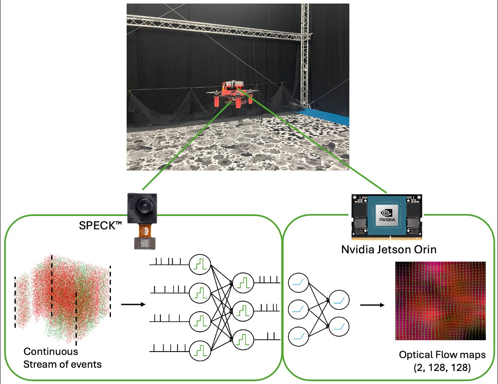

# Optical Flow Estimation using Speck Neuromorphic Hardware

Code for the ICRA 2026 paper
**"Optical Flow Estimation using Speck Neuromorphic Hardware"**
by Manupriya Singh, Dequan Ou, Jesse J. Hagenaars and Guido C. H. E. de Croon
(Micro Air Vehicle Lab, TU Delft).

[Paper (DOI)](https://doi.org/10.1109/ICRA57385.2026.11696264) · [Project page](https://mavlab.tudelft.nl/speck-optical-flow)



We estimate dense event-based optical flow with a hybrid SNN–ANN network. A spiking encoder
runs on the SynSense Speck chip, and a minGRU memory plus a convolutional decoder run on an Nvidia
Jetson Orin NX. The resulting flow drives closed-loop drone control (hover and forward flight) through PX4.

## Repository layout

| Folder | Contents |
|--------|----------|
| [`training/`](training) | Self-supervised training (contrast maximization, iterative warping) of the encoder–minGRU–decoder network; fork of [tinycmax](https://github.com/Huizerd/tinycmax). Uses the [`cuda_event_ops`](https://github.com/tudelft/cuda_event_ops) submodule. |
| [`speck_inference/`](speck_inference) | Speck devkit data collection, ANN→SNN conversion of the encoder, live hybrid inference on Speck + Jetson, latency/power scripts, and trained model weights (`Optical_Flow_run/`). |
| [`speckflow_ros2/`](speckflow_ros2) | ROS 2 (Humble) workspace that runs on the drone: `speck_flow` (Speck flow node), `speckflow_control` (flow-based PI controller and state machine for PX4 offboard), `mocap_relay`. |
| [`docs/`](docs) | Project web page. |

Clone with submodules:

```bash
git clone --recurse-submodules https://github.com/tudelft/speck-optical-flow.git
```

See the README in each folder for installation and usage.

## Speck firmware

The SynSense devkit firmware images that `speck_inference/SINABS_STUFF/images_flash.py` expects
(`motherBoardV2_0_11_5.img`, `Speck2eDevKit_1_0_1_1_0.bin`) are not included. Get them from SynSense.

## License

MIT, see [LICENSE](LICENSE). The `cuda_event_ops` submodule is a separate repository with its own terms.

## Citation

```bibtex
@inproceedings{singh2026speck,
  title     = {Optical Flow Estimation using Speck Neuromorphic Hardware},
  author    = {Singh, Manupriya and Ou, Dequan and Hagenaars, Jesse J. and de Croon, Guido C. H. E.},
  booktitle = {2026 IEEE International Conference on Robotics and Automation (ICRA)},
  pages     = {12859--12866},
  year      = {2026},
  doi       = {10.1109/ICRA57385.2026.11696264}
}
```
